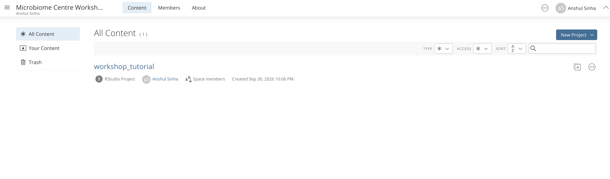
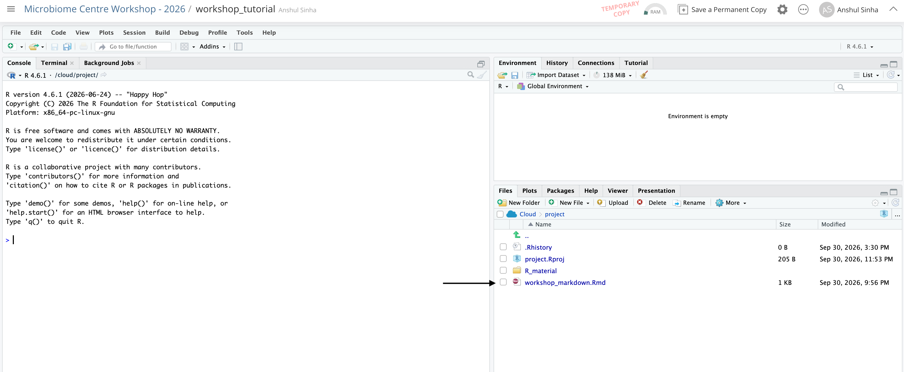
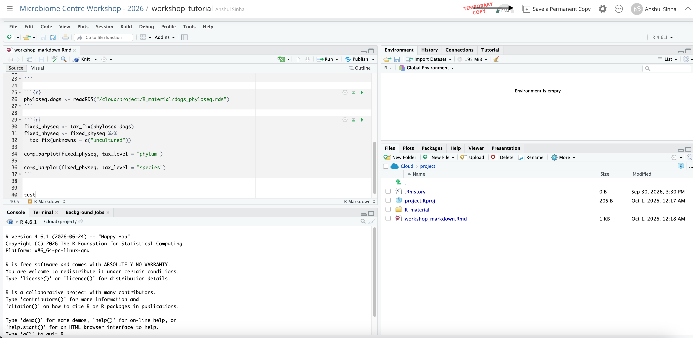
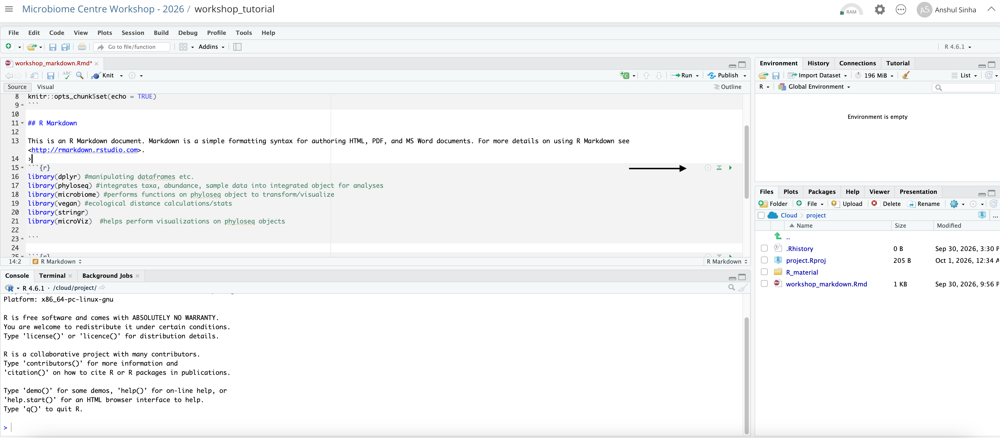

# Overview

The workshop will focus on the analysis and visualization of full-length 16S sequencing data using various R packages. We will work through the code together to ensure we are all on the same page, and stop frequently to discuss our progress and compare what we've run.

To help the hands-on session run smoothly, please complete one of the two preparation options before the workshop. Choose the option that best matches your experience with R.

# Option #1: For those with limited or no R experience

This workshop will focus more on the steps that we perform, rather than the R syntax itself, so don't sweat it if you don't have experience coding in R. Still, it would be beneficial to watch a quick intro video on R so you get a feel for how we write basic code. Short version: https://www.youtube.com/watch?v=FY8BISK5DpM . Longer version: [https://www.youtube.com/watch?v=yZ0bV2Afkjc](https://www.youtube.com/watch?v=yZ0bV2Afkjc&t=1636s)

To avoid having you go through the steps of installing R (programming language), R studio (interface where we write the code), and the required packages, we've set up a cloud-hosted version of R studio, with everything pre-installed. From here, you can work easily with the code that we will write during the workshop. Here are the simple instructions to set this up:

1\) Click on the link to our Posit Cloud shared space: <https://posit.cloud/spaces/826598/join?access_code=SV4W1-YcKgt9SbQrSZSbZc8bdItYSUTBRIB8_IDb>

You will be prompted to sign up for a Posit Cloud account. Please do so.

2\) Once you confirm your email and sign up confirm that you would like to join the shared space

3\) You should be directed to webpage that hosts the shared space for the workshop. Select "Content" on the tab at the top of the webpage. You should see a file named "workshop_tutorial". Please open this (it may take up to a minute).



4\) Once in the file is opened, open the markdown file in the bottom right corner in the "Files" panel



5\) This is the markdown file we will be working with the for the majority of the workshop. You can save a permanent version of this by clicking the "Save a permanent copy" button in the top right corner.



6\) To run a "chunk" of code you can press the green button at the top right corner of each chunk. You can check that the R packages we need are installed properly by pressing the green button on the chunk that start with "library(dplyr)". After this, you're all set!



# Option #2: For those with R experience

For those that have experience with R and R studio, you will need to install several packages before the workshop. We will be mostly be using the "phyloseq" package and several wrappers of this. You will also need to download the phyloseq object locally. Note that if you have difficulties with the steps below, I recommend following the instructions for option1 instead.

1\) Download the phyloseq object that we will be working with here:

[Download the phyloseq object](data/dogs_phyloseq.rds)

2\) In R studio, read in the phyloseq object using the following:

```{r}
#| eval: false

readRDS("yourfilepath/dogs_phyloseq.rds")
```

3\) Install the following packages in R

```{r}
#| eval: false

###Install phyloseq###

if (!require("BiocManager", quietly = TRUE))
    install.packages("BiocManager")

BiocManager::install("phyloseq")


###Install ape###

install.packages("ape")


###Install qiime2R###

if (!requireNamespace("devtools", quietly = TRUE)){install.packages("devtools")}
devtools::install_github("jbisanz/qiime2R")


###Install Microviz###

if (!requireNamespace("BiocManager", quietly = TRUE)) install.packages("BiocManager")
BiocManager::install(c("phyloseq", "microbiome", "ComplexHeatmap"), update = FALSE)

install.packages(
  "microViz",
  repos = c(davidbarnett = "https://david-barnett.r-universe.dev", getOption("repos"))
)


###Install Microbiome###

if (!require("BiocManager", quietly = TRUE))
    install.packages("BiocManager")

BiocManager::install("microbiome")


###Install vegan###
install.packages("vegan")
```

4\) Confirm installation

```{r}
#| eval: false

library(phyloseq)
library(qiime2R)
library(microViz)
library(ggplot2)
library(ape)
library(microbiome)
library(dplyr)
library(vegan)
```
